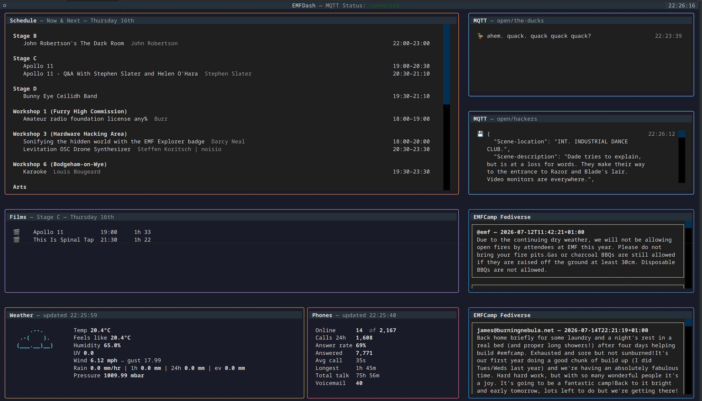

# EMF Dash



A TUI dashboard for EMF Camp, displaying live MQTT feeds in a split-panel terminal interface. Config currently hardcoded, but customisability and personal schedule/favourites feeds coming soon!

Currently weather in no way meets the docs, so we support both what is documented and what we're actually getting pre-event.

## Usage

```
mise run start
```

## Data sources

| Tile | MQTT topic | Description |
|------|------------|-------------|
| Schedule | — | Talks schedule via HTTP API (now & next) |
| Weather | `emf/weather/#` + `weather/hq` | Live weather station data (temp, humidity, wind, rain, UV, pressure) |
| Phones | `phones/#` | Phone system stats (calls, answer rate, talk time, voicemail) |
| Astley | `open/astley` | Rick Astley themed MQTT nonsense |
| Ducks | `open/the-ducks` | Duck-themed MQTT nonsense |
| Films | — | Film schedule via HTTP API |

## Tasks

| Command | Description |
|---------|-------------|
| `mise run start` | Run the dashboard |
| `mise run lint` | Lint with ruff |
| `mise run fix` | Auto-fix lint issues |
| `mise run fmt` | Format with ruff |
| `mise run test` | Run tests |
| `mise run ci` | Lint + test |

## Honorable mentions

ASCII art from [asciiart.eu](https://asciiart.eu).
